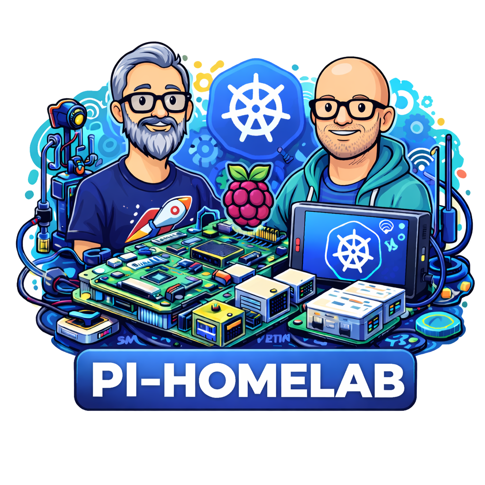

# Pi Homelab Project

This project is intended to be a collaborative space for [@messedpRyan](https://github.com/messedupryan) and \@whateverTomsNameIs. This project will contain resources related to using Raspberry Pi devices to host a kubernetes cluster running k3s. It will also contain a Jenkins Pipeline Library and various apps that we are running on our cluster. The primary goal if the project is learning.

## Tech Stack
- Raspberry Pi running [Raspberry Pi OS Lite](https://www.raspberrypi.com/software/operating-systems/)
- [k3s](https://k3s.io/) kubernetes cluster
    - [ingress-nginx](https://github.com/kubernetes/ingress-nginx) for inbound traffic
    - [Jenkins](https://www.jenkins.io/) for the build pipeline
    - [docker-registry](https://github.com/twuni/docker-registry.helm) for a private docker registry

## Personal Projects
### messedUpRyan
- EggChart: A website that is designed to create charts/graphs for data generated by EggTimer rocketry altimiters. This is a node.js frontend with a Python FastAPI backed.

### Tom's
- 

## Repositories:
- [pi-homelab-docs](https://github.com/pi-homelab-project/pi-homelab-docs): shared documenation and notes around cluster build and configuration
- [eggchart-ui](https://github.com/pi-homelab-project/eggchart-ui): Front end for EggChart
- [eggchart-api](https://github.com/pi-homelab-project/eggchart-api): Backed for EggChart
- [jenkins-pipeline-library](https://github.com/pi-homelab-project/jenkins-pipeline-library): Shared pipeline library for our Jenkins Build Server

